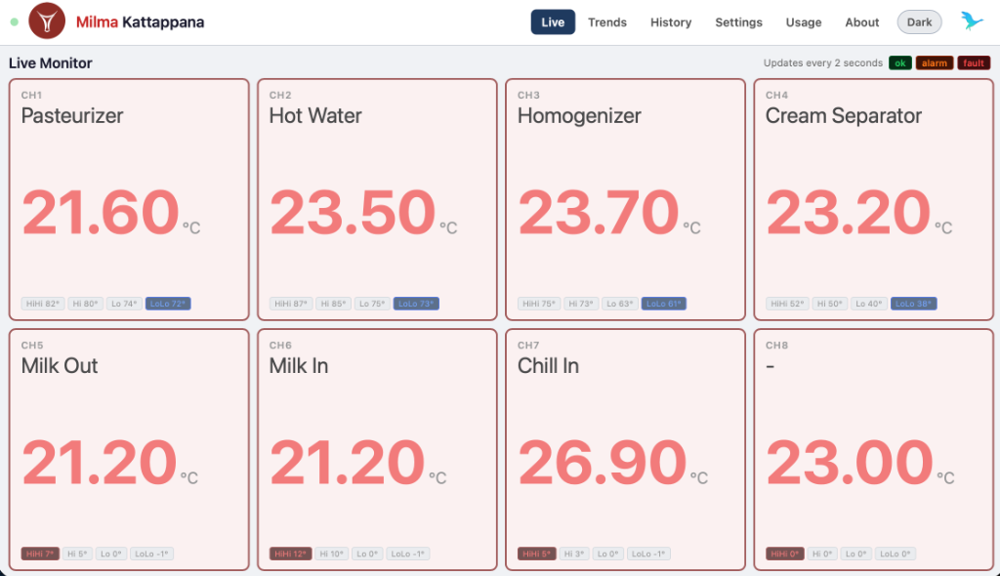
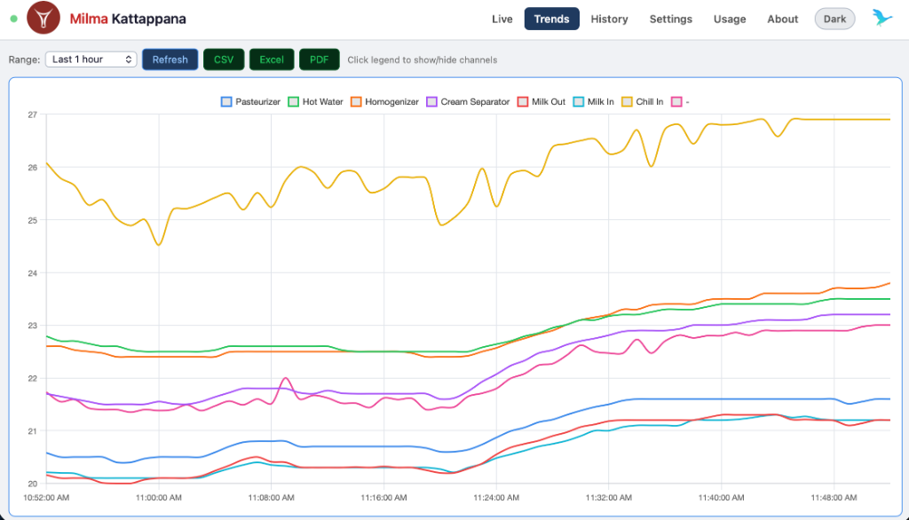
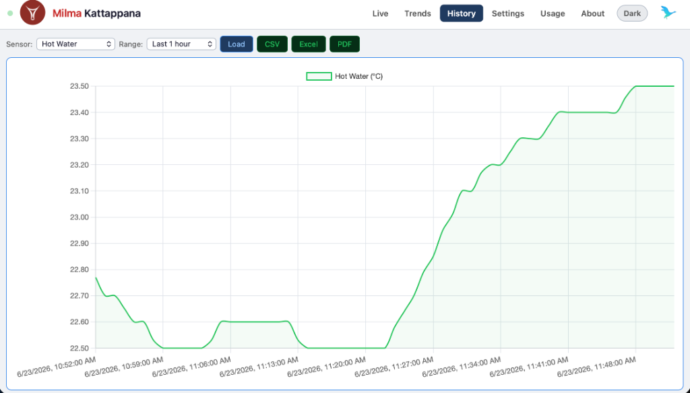
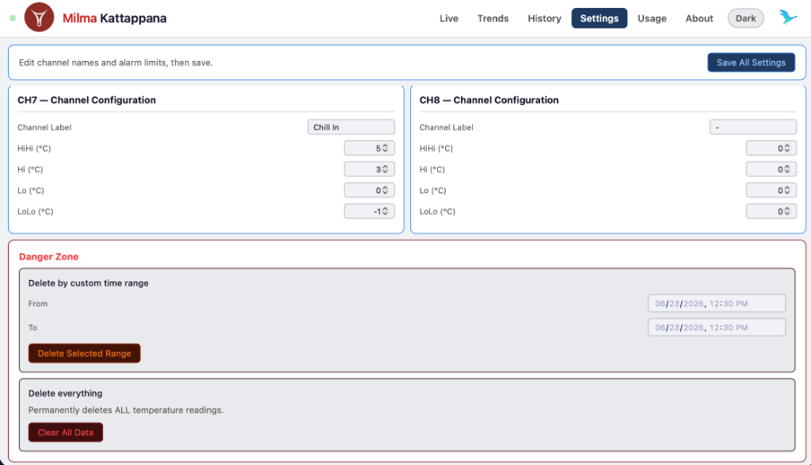
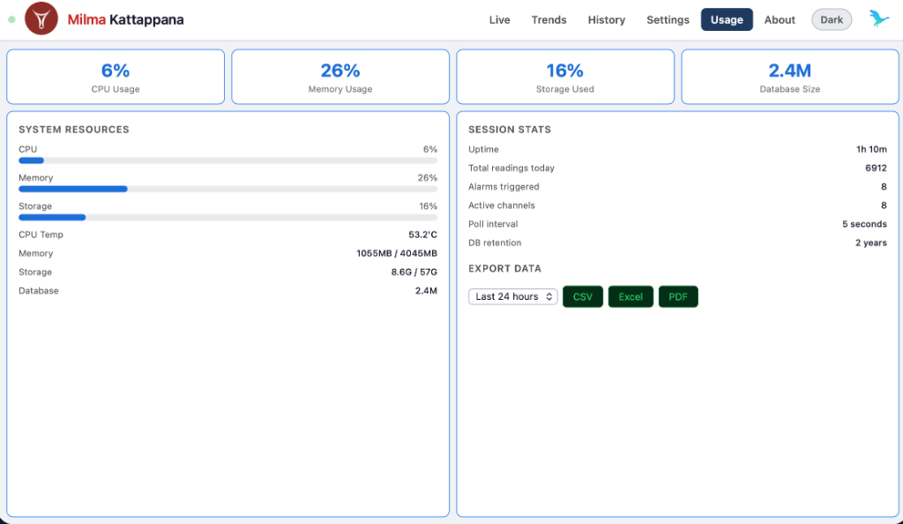
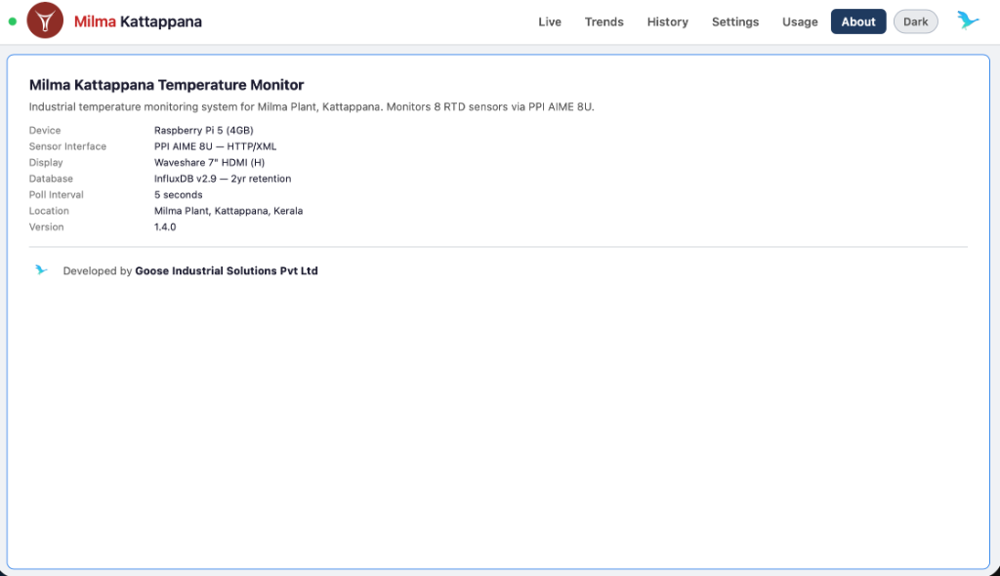

# Milma Kattappana — Temperature Monitoring System


A real-time industrial temperature monitoring dashboard for **Milma Plant, Kattappana, Kerala**. Monitors 8 RTD PT100 sensors via PPI AIME 8U, stores data in InfluxDB, and displays live readings on a Waveshare 7" HDMI display in kiosk mode.

---

## Screenshots
 
| Live Monitor | Trends |
|:---:|:---:|
|  |  |
| Real-time 8-channel temperature display with alarm indicators | Single multi-channel trend chart with click-to-hide |
 
| History | Settings |
|:---:|:---:|
|  |  |
| Query any sensor over custom date ranges | Configure channel names and alarm thresholds |
 
| Usage | About |
|:---:|:---:|
|  |  |
| Live CPU, memory, storage and database stats | System information and developer credits |
 
---


## Features

- **Live Monitoring** — 8 channel RTD temperature display, updates every 2 seconds via WebSocket
- **Alarm System** — Green (normal), Amber (Hi/Lo breach), Red flashing (HiHi/LoLo critical)
- **Historical Trends** — Single multi-channel chart with click-to-hide per channel
- **History Query** — Query any sensor over 1h / 6h / 24h / 7d / 30d
- **Data Export** — CSV, Excel (.xlsx), and PDF with Milma + Goose branding
- **Settings** — Rename channels, configure alarm thresholds per channel
- **Usage Stats** — Live CPU, memory, storage, and database size monitoring
- **Dark / Light Mode** — Theme toggle with preference saved locally
- **Kiosk Mode** — Auto-launches fullscreen on boot via Chromium
- **Data Retention** — 2 year automatic retention policy on InfluxDB

---

## System Architecture

```
RTD Sensors (x8) — PT100
        ↓
PPI AIME 8U (HTTP/XML over Ethernet)
        ↓
Raspberry Pi 5 (4GB)
├── Python Poller     → reads AIME 8U every 5s, writes to InfluxDB
├── InfluxDB v2.9     → time-series database (2yr retention)
├── Node.js Server    → WebSocket + REST API on port 3001
└── Chromium Kiosk    → fullscreen dashboard on Waveshare 7" display
```

---

## Hardware

| Component | Details |
|---|---|
| Computer | Raspberry Pi 5 (4GB RAM) |
| OS | Raspberry Pi OS Trixie (Debian 13) aarch64 |
| Display | Waveshare 7" HDMI LCD (H) — 1024×600 |
| Sensor Interface | PPI AIME 8U — HTTP/XML over Ethernet |
| Sensors | PT100 RTD (up to 8 channels) |
| Storage | 64GB SD card |
| Network | Ethernet via switch |

---

## Software Stack

| Component | Technology |
|---|---|
| Data Poller | Python 3.13 + requests |
| Database | InfluxDB v2.9.1 |
| Backend | Node.js v20 + Express + WebSocket (ws) |
| Frontend | Vanilla HTML/CSS/JS + Chart.js |
| Export | jsPDF + SheetJS (xlsx) |
| Kiosk | Chromium in kiosk mode via autostart |

---

## Project Structure

```
Milma_Kattappana/
├── server.js           # Node.js WebSocket + REST API server
├── package.json        # Node.js dependencies
├── poller.py           # Python RTD data poller (HTTP/XML from AIME 8U)
├── public/
│   └── index.html      # Dashboard frontend (single file app)
├── milma_logo.png      # Milma logo
├── goose_logo.png      # Goose Industrial Solutions logo
└── README.md
```

---

## Installation

### Prerequisites
- Raspberry Pi 5 with Raspberry Pi OS (Trixie/Bookworm)
- Node.js v20+
- Python 3.13+
- InfluxDB v2.9+

### 1. Clone the repository
```bash
git clone https://github.com/Soorya-Narayan/Milma_Kattappana.git
cd Milma_Kattappana
```

### 2. Install Node.js dependencies
```bash
npm install
```

### 3. Set up Python virtual environment
```bash
python3 -m venv venv
source venv/bin/activate
pip install requests influxdb-client
```

### 4. Configure InfluxDB
```bash
influx setup
# Organization: milma_kattappana
# Bucket: temperature_data
# Retention: 0 (infinite, set via CLI later)

# Set 2 year retention
influx bucket update --name temperature_data --retention 17520h
```

### 5. Update configuration in poller.py
```python
INFLUX_TOKEN  = "your_influxdb_token"
AIME_URL      = "http://192.168.1.2/index.xml"  # AIME 8U IP
```

### 6. Update configuration in server.js
```javascript
const INFLUX_TOKEN = 'your_influxdb_token';
```

### 7. Set up systemd services
```bash
# Copy service files
sudo cp systemd/milma-poller.service /etc/systemd/system/
sudo cp systemd/milma-dashboard.service /etc/systemd/system/

sudo systemctl daemon-reload
sudo systemctl enable milma-poller milma-dashboard
sudo systemctl start milma-poller milma-dashboard
```

### 8. Set up kiosk mode
```bash
mkdir -p ~/.config/autostart

cat > ~/.config/autostart/milma-kiosk.desktop << 'DESKTOP'
[Desktop Entry]
Type=Application
Name=Milma Kiosk
Exec=/bin/bash -c "sleep 10 && chromium --noerrdialogs --disable-infobars --kiosk --app=http://localhost:3001"
X-GNOME-Autostart-enabled=true
DESKTOP
```

---

## Network Configuration

| Device | IP Address |
|---|---|
| Raspberry Pi (Static) | 192.168.1.69 |
| PPI AIME 8U | 192.168.1.2 |
| Gateway | 192.168.1.1 |

### Access the dashboard
```
http://192.168.1.69:3001        # From any PC on the network
http://raspberrypi.local:3001   # Using hostname
```

---

## Default Alarm Thresholds

| Channel | Process | Normal Range | Lo | Hi | LoLo | HiHi |
|---|---|---|---|---|---|---|
| CH1 | Pasteuriser | 74–80°C | 74 | 80 | 72 | 82 |
| CH2 | Hot Water | 75–85°C | 75 | 85 | 73 | 87 |
| CH3 | Homo | 63–73°C | 63 | 73 | 61 | 75 |
| CH4 | Cream Separator | 40–50°C | 40 | 50 | 38 | 52 |
| CH5 | Milk Out | 0–5°C | 0 | 5 | -1 | 7 |
| CH6 | Milk In | 0–10°C | 0 | 10 | -1 | 12 |
| CH7 | Chill In | 0–3°C | 0 | 3 | -1 | 5 |
| CH8 | Ambient | 10–45°C | 10 | 45 | 5 | 50 |

Thresholds can be updated anytime via the **Settings** tab in the dashboard.

---

## Usage

### Changing alarm thresholds
1. Open `http://192.168.1.69:3001` on any PC
2. Click **Settings**
3. Update values and click **Save All Settings**

### Exporting data
1. Go to **History** tab
2. Select sensor and date range
3. Click **CSV**, **Excel**, or **PDF**

### Viewing trends
1. Go to **Trends** tab
2. Click any channel name in the legend to show/hide it

---

## Troubleshooting

| Problem | Solution |
|---|---|
| Dashboard not on screen | Power cycle the Pi |
| All channels showing -- | Check AIME 8U power and ethernet |
| Cannot access from PC | Ensure same network, try hostname |
| Wrong readings | Check RTD wiring on AIME 8U |

---

## License

MIT License — see [LICENSE](LICENSE) for details.

---
